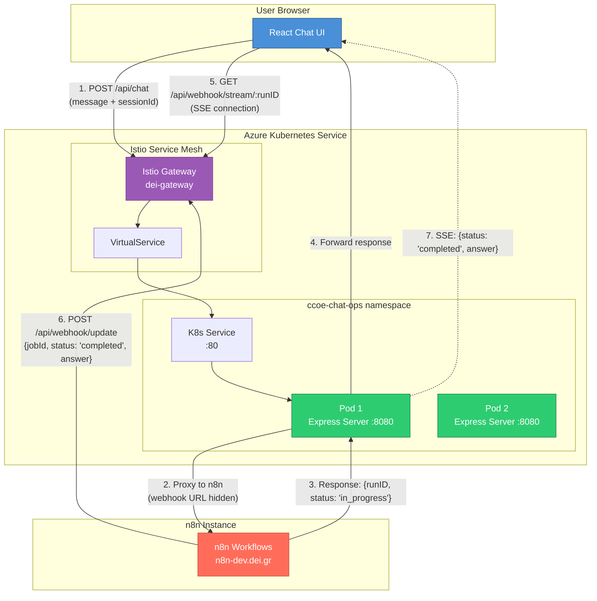

# CCoE Chat Ops

A full-stack TypeScript chat UI microservice designed for Azure Kubernetes Service (AKS) with Istio. The frontend communicates directly with n8n workflows, while n8n sends completion updates back through the backend's webhook endpoint.

## Architecture



### Communication Flow

1. **User sends message**: Browser POSTs to `/api/chat` on the Express backend
2. **Backend proxies to n8n**: Server forwards request to n8n (webhook URL stays server-side only)
3. **n8n acknowledges**: Returns `{runID, status: 'in_progress'}` immediately
4. **Backend forwards response**: Sends n8n response back to browser
5. **UI subscribes to SSE**: Opens EventSource to `/api/webhook/stream/:runID`
6. **n8n workflow completes**: POSTs result to `/api/webhook/update` with `{jobId, status, answer}`
7. **SSE delivers update**: Backend pushes the completion message to the connected browser

### Security Design

| Value | Exposed in Browser? | Notes |
|-------|---------------------|-------|
| `AZURE_CLIENT_ID` | ✅ Yes | Public by OIDC design - identifies the app |
| `AZURE_TENANT_ID` | ✅ Yes | Public by OIDC design - identifies the tenant |
| `N8N_WEBHOOK_URL` | ❌ No | Stays server-side only via `/api/chat` proxy |

**Note**: Azure Client ID and Tenant ID are intentionally public values in OAuth/OIDC. Security is enforced by Azure Entra ID validating redirect URIs, not by hiding these identifiers.

## Tech Stack

| Layer | Technology |
|-------|------------|
| Frontend | React 18, TypeScript, Tailwind CSS, shadcn/ui |
| Backend | Node.js, Express, TypeScript |
| Orchestration | Kubernetes (AKS), Istio |
| Workflow Engine | n8n |
| Real-time | Server-Sent Events (SSE) |

## Project Structure

```
├── src/                    # React frontend source
│   ├── components/         # UI components (chat, ui)
│   ├── hooks/              # Custom hooks (useChat, useSSEUpdates)
│   ├── lib/                # API utilities
│   └── pages/              # Page components
├── server/                 # Express backend
│   └── src/
│       ├── routes/
│       │   ├── health.ts   # Health check endpoint
│       │   ├── chat.ts     # n8n proxy (keeps webhook URL private)
│       │   └── webhook.ts  # n8n update receiver + SSE streaming
│       └── index.ts        # Server entry point
├── k8s/                    # Kubernetes manifests
│   ├── namespace.yaml      # Namespace with Istio injection
│   ├── configmap.yaml      # Runtime configuration
│   ├── deployment.yaml     # Pod deployment
│   ├── service.yaml        # ClusterIP service
│   └── istio.yaml          # VirtualService + DestinationRule
├── Dockerfile              # Multi-stage production build
└── README.md               # This file
```

## API Endpoints

### Health Check
```
GET /health
Response: { "status": "ok" }
```

### Chat Proxy (Browser → Backend → n8n)
```
POST /api/chat
Content-Type: multipart/form-data
Body: {
  "sessionId": "user-session-id",
  "message": "user message text",
  "files[]": [optional file attachments],
  "voice": [optional voice recording]
}
Response: { "runID": "...", "status": "in_progress" } or direct answer
```

### Webhook Update (n8n → Backend)
```
POST /api/webhook/update
Body: {
  "jobId": "execution-id",
  "sessionId": "user-session",
  "status": "pending" | "completed" | "error",
  "answer": "response text",
  "meta": { optional metadata },
  "error": "error message (when status=error)"
}
Response: { "success": true, "message": "Update received for job {jobId}" }
```

### Status Polling (fallback)
```
GET /api/webhook/status/:jobId
Response: { "status": "pending" | "completed" | "error", "answer": "..." }
```

### SSE Stream (Browser → Backend)
```
GET /api/webhook/stream/:jobId
Response: text/event-stream
Events: data: {"status": "completed", "answer": "..."}
```

---

# AKS Deployment Guide

A step-by-step guide to deploy CCoE Chat Ops to Azure Kubernetes Service with Istio ingress.

## Prerequisites

Before starting, ensure you have:

- [ ] Azure CLI installed (`az --version`)
- [ ] kubectl installed (`kubectl version`)
- [ ] Docker installed (`docker --version`)
- [ ] Access to an Azure subscription with AKS and ACR
- [ ] Istio gateway already configured in your cluster

## Step 1: Azure Login & Configuration

```bash
# Login to Azure
az login

# Set your subscription (replace with your subscription ID or name)
az account set --subscription "<YOUR_SUBSCRIPTION_ID>"

# Get AKS credentials (replace with your resource group and cluster name)
az aks get-credentials --resource-group <RESOURCE_GROUP> --name <AKS_CLUSTER_NAME>

# Verify connection
kubectl get nodes
```

## Step 2: Login to Azure Container Registry

```bash
# Login to ACR (replace with your ACR name)
az acr login --name <YOUR_ACR_NAME>

# Verify login
docker info | grep "Username"
```

## Step 3: Build and Push Docker Image

```bash
# Navigate to project root
cd /path/to/ccoe-chat-ops

# Build the Docker image
docker build -t <YOUR_ACR_NAME>.azurecr.io/ccoe-chat-ops:v1.0.0 .

# Push to ACR
docker push <YOUR_ACR_NAME>.azurecr.io/ccoe-chat-ops:v1.0.0

# Optional: Also tag as latest
docker tag <YOUR_ACR_NAME>.azurecr.io/ccoe-chat-ops:v1.0.0 <YOUR_ACR_NAME>.azurecr.io/ccoe-chat-ops:latest
docker push <YOUR_ACR_NAME>.azurecr.io/ccoe-chat-ops:latest
```

## Step 4: Update Kubernetes Manifests

### 4.1 Update `k8s/deployment.yaml`

Find and replace the image placeholder:

```yaml
# Line 24: Replace <YOUR_ACR_NAME> with your actual ACR name
image: <YOUR_ACR_NAME>.azurecr.io/ccoe-chat-ops:v1.0.0
```

**Example:**
```yaml
image: mycompanyacr.azurecr.io/ccoe-chat-ops:v1.0.0
```

### 4.2 Update `k8s/istio.yaml`

Find and update these two sections:

```yaml
# Line 18: Replace with your actual domain
hosts:
  - ccoe-chat-ops-dev.dei.gr    # ← Your domain here

# Line 24: Replace with your Istio gateway reference
gateways:
  - istio-system/dei-gateway    # ← Your gateway here (namespace/name)
```

### 4.3 Update `k8s/configmap.yaml` (Optional)

If you want to restrict CORS to a specific origin:

```yaml
# Line 17: Set to your frontend domain
ALLOWED_ORIGIN: "https://ccoe-chat-ops-dev.dei.gr"
```

## Step 5: Deploy to AKS

Deploy the manifests in this exact order:

```bash
# 1. Create the namespace (with Istio sidecar injection enabled)
kubectl apply -f k8s/namespace.yaml

# 2. Create the ConfigMap
kubectl apply -f k8s/configmap.yaml

# 3. Deploy the application
kubectl apply -f k8s/deployment.yaml

# 4. Create the Service
kubectl apply -f k8s/service.yaml

# 5. Apply Istio routing rules
kubectl apply -f k8s/istio.yaml
```

**One-liner alternative:**
```bash
kubectl apply -f k8s/
```

## Step 6: Verify Deployment

### 6.1 Check Pod Status

```bash
# List pods in the namespace
kubectl get pods -n ccoe-chat-ops

# Expected output:
# NAME                             READY   STATUS    RESTARTS   AGE
# ccoe-chat-ops-xxxxxxxxx-xxxxx    2/2     Running   0          1m
# ccoe-chat-ops-xxxxxxxxx-xxxxx    2/2     Running   0          1m
```

> **Note:** `2/2` indicates both the app container and Istio sidecar are running.

### 6.2 Check All Resources

```bash
# Check deployment
kubectl get deployment -n ccoe-chat-ops

# Check service
kubectl get service -n ccoe-chat-ops

# Check Istio resources
kubectl get virtualservice,destinationrule -n ccoe-chat-ops
```

### 6.3 View Pod Logs

```bash
# Get logs from a specific pod
kubectl logs -n ccoe-chat-ops -l app=ccoe-chat-ops -c ccoe-chat-ops --tail=100

# Follow logs in real-time
kubectl logs -n ccoe-chat-ops -l app=ccoe-chat-ops -c ccoe-chat-ops -f
```

### 6.4 Test Health Endpoint

```bash
# From within the cluster
kubectl run curl-test --rm -it --image=curlimages/curl --restart=Never -- \
  curl -s http://ccoe-chat-ops.ccoe-chat-ops.svc.cluster.local/health

# Expected output: {"status":"ok"}
```

### 6.5 Test External Access

```bash
# From your local machine (after DNS is configured)
curl https://ccoe-chat-ops-dev.dei.gr/health

# Expected output: {"status":"ok"}
```

## Step 7: Configure n8n Webhook

In your n8n workflow, configure the HTTP Request node to POST completion updates:

| Setting | Value |
|---------|-------|
| Method | POST |
| URL | `https://ccoe-chat-ops-dev.dei.gr/api/webhook/update` |
| Content-Type | application/json |

**Request Body:**
```json
{
  "jobId": "{{ $execution.id }}",
  "sessionId": "{{ $json.sessionId }}",
  "status": "completed",
  "answer": "{{ $json.result }}"
}
```

## Updating the Application

When you need to deploy a new version:

```bash
# 1. Build new image with new tag
docker build -t <YOUR_ACR_NAME>.azurecr.io/ccoe-chat-ops:v1.0.1 .
docker push <YOUR_ACR_NAME>.azurecr.io/ccoe-chat-ops:v1.0.1

# 2. Update deployment with new image
kubectl set image deployment/ccoe-chat-ops \
  ccoe-chat-ops=<YOUR_ACR_NAME>.azurecr.io/ccoe-chat-ops:v1.0.1 \
  -n ccoe-chat-ops

# 3. Watch rollout progress
kubectl rollout status deployment/ccoe-chat-ops -n ccoe-chat-ops
```

## Rollback

If something goes wrong:

```bash
# Rollback to previous version
kubectl rollout undo deployment/ccoe-chat-ops -n ccoe-chat-ops

# Check rollout history
kubectl rollout history deployment/ccoe-chat-ops -n ccoe-chat-ops

# Rollback to specific revision
kubectl rollout undo deployment/ccoe-chat-ops -n ccoe-chat-ops --to-revision=2
```

## Troubleshooting

### Pod stuck in Pending state

```bash
# Check pod events
kubectl describe pod -n ccoe-chat-ops -l app=ccoe-chat-ops

# Common causes:
# - Insufficient resources: Increase node count or reduce resource requests
# - Image pull error: Verify ACR login and image name
```

### Pod stuck in CrashLoopBackOff

```bash
# Check container logs
kubectl logs -n ccoe-chat-ops -l app=ccoe-chat-ops -c ccoe-chat-ops --previous

# Check Istio sidecar logs
kubectl logs -n ccoe-chat-ops -l app=ccoe-chat-ops -c istio-proxy
```

### 502/503 Gateway Errors

```bash
# Check if pods are ready
kubectl get pods -n ccoe-chat-ops

# Check Istio configuration
kubectl get virtualservice -n ccoe-chat-ops -o yaml
kubectl get destinationrule -n ccoe-chat-ops -o yaml

# Verify service endpoints
kubectl get endpoints -n ccoe-chat-ops
```

### SSE Connection Drops

The Istio configuration includes 1-hour timeouts for SSE. If connections still drop:

```bash
# Verify Istio timeout settings
kubectl get virtualservice ccoe-chat-ops -n ccoe-chat-ops -o yaml | grep timeout

# Check DestinationRule idle timeout
kubectl get destinationrule ccoe-chat-ops -n ccoe-chat-ops -o yaml | grep idleTimeout
```

### Image Pull Errors

```bash
# Verify ACR attachment to AKS
az aks check-acr --resource-group <RESOURCE_GROUP> --name <AKS_CLUSTER_NAME> --acr <ACR_NAME>.azurecr.io

# If not attached, attach ACR to AKS
az aks update --resource-group <RESOURCE_GROUP> --name <AKS_CLUSTER_NAME> --attach-acr <ACR_NAME>
```

### Debugging Inside Pod

```bash
# Execute shell in pod
kubectl exec -it -n ccoe-chat-ops <POD_NAME> -c ccoe-chat-ops -- /bin/sh

# Check environment variables
kubectl exec -n ccoe-chat-ops <POD_NAME> -c ccoe-chat-ops -- env | grep -E "PORT|NODE_ENV|ALLOWED"

# Test internal connectivity
kubectl exec -n ccoe-chat-ops <POD_NAME> -c ccoe-chat-ops -- wget -qO- http://localhost:8080/health
```

## Quick Reference - Files to Update

| File | Line | What to Update |
|------|------|----------------|
| `k8s/deployment.yaml` | 24 | `<YOUR_ACR_NAME>.azurecr.io/ccoe-chat-ops:v1.0.0` |
| `k8s/istio.yaml` | 18 | Your domain (e.g., `ccoe-chat-ops-dev.dei.gr`) |
| `k8s/istio.yaml` | 24 | Your Istio gateway (e.g., `istio-system/dei-gateway`) |
| `src/lib/api.ts` | 21 | n8n webhook URL (hardcoded or via env var) |

## License

MIT
